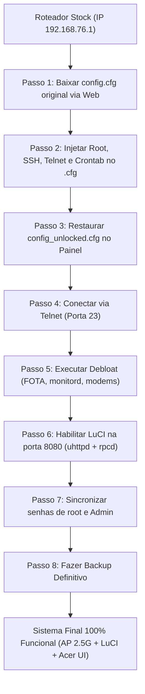

# Descobertas de Engenharia Reversa: LuCI Nativo, Fix de Autenticação, Debloat e Arquitetura

> **Resumo**: Este documento registra as descobertas fundamentais de software do **Acer Predator Connect T7** (Qualcomm IPQ5332), o desbloqueio da interface oficial do OpenWrt (**LuCI**) que já estava oculta no firmware original, a correção do mecanismo de autenticação via RPC, a desativação de ameaças de sobrescrita automática de firmware (FOTA) e a arquitetura adotada para transformar o roteador em uma central OpenWrt híbrida de altíssimo desempenho.

---

## 1. A Descoberta do LuCI Nativo Oculto

Durante a inspeção minuciosa dos pacotes instalados e da estrutura de arquivos da memória Flash (`/rom` e `/overlay`), revelou-se que a Acer **não removeu os componentes do OpenWrt oficial**:

### Componentes Encontrados Intactos:
* **Binário Web Server OpenWrt:** `/usr/sbin/uhttpd`
* **Árvore de Código do LuCI:** `/usr/lib/lua/luci/`
* **Página Web e Assets do LuCI:** `/www/` (contendo `/www/cgi-bin/luci` e `/www/luci-static/bootstrap/`)
* **Módulos do LuCI Instalados:**
  * `luci-base`
  * `luci-theme-bootstrap` (Tema clássico oficial azul)
  * `luci-app-firewall`
  * `luci-app-ddns`
  * `luci-app-opkg`
  * `luci-app-samba4`
  * `luci-app-upnp`
  * `luci-app-openvpn`

### Por que o LuCI estava inativo?
A Acer simplesmente desativou o `uhttpd` nos scripts de boot para não conflitar com o servidor web próprio dela (`lighttpd`).  
No arquivo `/etc/rc.local`, encontramos o comentário literal deixado pelo engenheiro de software da fabricante:

```sh
##disable default web server and enable lighttpd as web server. by zhanglei
/etc/init.d/uhttpd stop
/etc/init.d/lighttpd/lighttpd.init start
```

---

## 2. Diagnóstico e Resolução do Problema de Login no LuCI

Ao iniciarmos o `uhttpd` na porta `8080`, a página de login abriu normalmente, mas as tentativas de autenticação falhavam. A análise reversa do código revelou **duas causas principais**:

### Causa A: O Subsistema `rpcd` só autorizava o usuário `root`
O LuCI moderno não valida a senha lendo o `/etc/passwd` diretamente; ele chama o daemon **`rpcd`** através do barramento de sistema IPC **`ubus`** (`ubus call session login`).  
No arquivo `/etc/config/rpcd`, a Acer havia mantido a configuração padrão pura do OpenWrt:

```uci
config login
        option username 'root'
        option password '$p$root'
        list read '*'
        list write '*'
```
* **O Problema:** Como a conta principal de fábrica da Acer se chama `Admin` (e não `root`), qualquer tentativa de login com `Admin` era rejeitada com `Command failed: Permission denied`.

### Causa B: Hash de senha descompassado no `/etc/shadow`
No Linux do roteador, a diretiva `$p$root` faz o `rpcd` buscar a hash criptografada do usuário `root` diretamente no arquivo `/etc/shadow`. Como o usuário `root` havia sido recém-injetado, sua hash não correspondia à senha definida no painel.

### 🛠️ O Fix de Autenticação Aplicado:
1. **Autorização de Ambos os Usuários no `rpcd`:**  
   Adicionamos o usuário `Admin` à tabela de logins do RPC com permissões administrativas totais (`read *` e `write *`):
   ```sh
   uci add rpcd login
   uci set rpcd.@login[-1].username='Admin'
   uci set rpcd.@login[-1].password='$p$Admin'
   uci add_list rpcd.@login[-1].read='*'
   uci add_list rpcd.@login[-1].write='*'
   uci commit rpcd
   /etc/init.d/rpcd restart
   ```

2. **Sincronização de Senhas no `/etc/shadow`:**  
   Geramos a hash MD5-crypt (`$1$kMEMhTxY$sPDoqUPT7zj5ats82mEdO0`) correspondente à senha **`admin0100`** e gravamos tanto para `root` quanto para `Admin`:
   ```sh
   sed -i "s|^root:.*|root:\$1\$kMEMhTxY\$sPDoqUPT7zj5ats82mEdO0:20725:0:99999:7:::|" /etc/shadow
   sed -i "s|^Admin:.*|Admin:\$1\$kMEMhTxY\$sPDoqUPT7zj5ats82mEdO0:20725:0:99999:7:::|" /etc/shadow
   ```

3. **Resultado:** Tanto o usuário `root` quanto o usuário `Admin` logam com sucesso com a senha `admin0100` no LuCI e no SSH.

---

## 3. Arquitetura Dual-Web Persistente (Porta 80 vs Porta 8080)

Para manter o melhor dos dois mundos (o controle estético dos LEDs RGB e o painel Gamer da Acer, somado ao poder irrestrito do OpenWrt LuCI), configuramos os dois servidores web para rodarem em portas separadas:

| Porta | Servidor Web | Interface | Finalidade |
| :---: | :---: | :---: | :--- |
| **80** | `lighttpd` | **Painel Gamer Acer** | Interface visual original, controle de RGB, monitor |
| **8080** | `uhttpd` | **OpenWrt LuCI Oficial** | Gestão pura de redes, VLANs, firewall, status e plugins |

### Persistência no Boot e Watchdog de Segurança:
1. No `/etc/rc.local` (antes do `exit 0`):
   ```sh
   /usr/sbin/uhttpd -p 8080 -h /www -x /cgi-bin
   ```
2. No `/etc/crontabs/Admin` e `/etc/crontabs/root` (watchdog a cada 60s):
   ```cron
   * * * * * pgrep uhttpd || /usr/sbin/uhttpd -p 8080 -h /www -x /cgi-bin
   ```

---

## 4. A Descoberta Crítica do FOTA e o Debloat de Segurança

Ao inspecionar o agendador de tarefas do sistema (`crontab -l`), descobrimos um mecanismo perigoso de fábrica que colocava em risco qualquer customização:

```cron
0 3 * * * /lib/functions/silent-reboot.sh
10 0 * * * /lib/functions/download_img.sh
46 2 * * * /lib/functions/update_img.sh
```

### O que esses scripts faziam?
* **00:10:** Conectava na nuvem da Acer e baixava automaticamente uma nova imagem de firmware (`nand-4k-ipq5332-single.img`) para a pasta `/tmp`.
* **02:46:** Se a imagem estivesse baixada, executava `fota ipq install` (gravava na Flash da Acer sem pedir permissão ao usuário).
* **03:00:** Dava um reboot silencioso (`silent-reboot.sh`).
* **Consequência:** Na primeira atualização automática lançada pela Acer, todo o acesso SSH, Telnet, modo AP e LuCI seriam apagados.

### Daemons Fantasmas de Modem Celular 5G:
O firmware do Predator T7 foi derivado do modelo 5G (com slot SIM card). Como o T7 não possui modem celular físico, os daemons:
* `modem_readd`
* `modem-monitor`
* `modem_read_init`
* `at_ril` e `ril`  
Ficavam em loop infinito acordando a cada poucos segundos, tentando falar com barramentos inexistentes e gravando mensagens de erro no `/tmp`.

### Daemons de Telemetria Pesada:
* `monitord` (telemetria da nuvem Acer)
* `sodd` (daemon de telemetria)
* `cwmp` (TR-069 de operadoras)
* `mqtt_client` e `breakpad`

### Ação de Debloat Aplicada (`apply_debloat.py`):
1. **Crontab saneado:** Removidas as chamadas de FOTA e silent-reboot.
2. **Scripts bloqueados:** `chmod -x` em `silent-reboot.sh`, `download_img.sh`, `update_img.sh` e `/usr/sbin/fota`.
3. **Serviços desativados no boot:** `disable` e `stop` em `modem-monitor`, `at_ril`, `ril`, `monitord`, `sodd`, `cwmp`, `mqtt_client`, `breakpad`.
4. **Logs limpos:** Removidos arquivos de log gigantescos em `/tmp`, liberando memória RAM e reduzindo o desgaste do chip.

---

## 5. Validação na Indústria: O Caso do GL.iNet Flint 3 (GL-BE9300)

Nossa pesquisa na comunidade internacional revelou que a **GL.iNet** (maior fabricante mundial de roteadores com OpenWrt) adotou **exatamente essa mesma estratégia** no seu roteador topo de linha **Flint 3 (GL-BE9300)**:

* **Processador:** Qualcomm IPQ5332 (O mesmo do Predator T7).
* **Kernel de Fábrica:** **Linux 5.4.213 (Qualcomm QSDK)** (O mesmo do Predator T7).
* **Interface:** OpenWrt LuCI moderno rodando sobre o kernel 5.4.
* **Por que essa arquitetura é superior:**
  * O kernel Linux mainline (6.6 / 6.12) ainda não possui suporte maduro ao Wi-Fi 7 MLO (320 MHz) nem ao acelerador de pacotes **PPE/NSS da Qualcomm**.
  * No kernel novo, 2 Gbps de tráfego consome 100% de CPU.
  * No kernel 5.4 QSDK da Qualcomm, os módulos `qca-nss-ppe.ko` e `ecm.ko` aceleram o tráfego diretamente no hardware com **0% a 1% de uso de CPU**.

---

## 6. Blueprint para a Futura Automação Completa (All-in-One)

Para automatizar 100% desse processo em qualquer Acer Predator Connect T7 no futuro, o fluxo lógico do script unificado (`setup_t7_full_auto.py`) será:



Com este registro, todo o conhecimento adquirido está documentado e pronto para ser transformado em uma ferramenta automatizada de um único clique!
