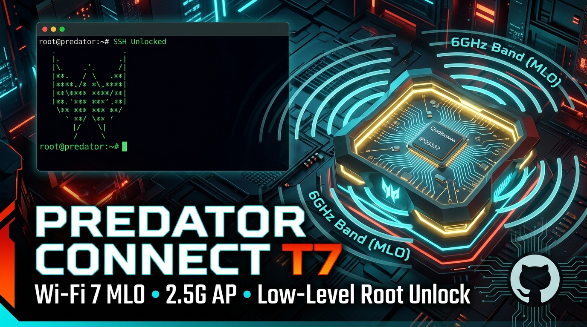

<p align="center">
  
</p>

<p align="center">
  <b>🌐 Language / Idioma:</b>
  <a href="README.md"><b>🇺🇸 English</b></a> |
  <a href="README_PT.md">🇧🇷 Português (Brasil)</a>
</p>

# Acer Predator Connect T7 — Root Unlock, 2.5 Gbps AP Mode, Wi-Fi 7 & Dual-Boot Architecture

> **Project Status (October 2026)**: Running in production on **Slot 2 (`rootfs_1`)** with **Official Firmware v1.01.000027 (v27)**, native **LuCI on Port 80**, **pure 2.5 Gbps Layer-2 switch acceleration**, **Wi-Fi 7 (320 MHz / 5.76 Gbps)** with 802.11k/v Roaming, and comprehensive debloat. **Slot 1 (`rootfs`) is retained 100% untouched as an unbrickable golden recovery image**.

> **Keywords / SEO**: Acer Predator Connect T7, Wi-Fi 7 router unlock, Qualcomm IPQ5332, MLO 6GHz, AP Mode 2.5Gbps, root access dropbear, telnet unlock, unbrick predator t7, openwrt predator t7, double NAT fix, dual-boot slot rollback, firmware dump MTD.

---

## ⚡ Quick Feature Summary

* 🛡️ **Safe A/B Dual-Boot:** Slot 1 (`mtd21` / factory v24) is an immutable recovery reserve. All custom work runs on Slot 2 (`mtd20` / v27).
* 🔄 **Instant 1-Command Rollback:** If Slot 2 has any issue, `/usr/sbin/boot-acer` restores boot to Slot 1 in seconds.
* 🌐 **Native LuCI on Port 80:** Acer's proprietary web server (`lighttpd`) disabled; standard LuCI (`uhttpd`) promoted to primary web server.
* 🚀 **Pure 2.5 Gbps Switch (AP Mode):** Netfilter bridge bypass (`net.bridge.bridge-nf-call-iptables = 0`) eliminates DHCP/mDNS/AirPlay drops and provides wire-speed Layer-2 throughput.
* 📶 **Turbo Wi-Fi 7 & Protocol Accelerations:** 6 GHz radio in 320 MHz width (5.76 Gbps) with Preamble Puncturing (anti-interference), Target Wake Time (TWT - phone battery saving), BSS Coloring, 4x4 Beamforming, OFDMA, and Fast Roaming 802.11k/v/r (<50ms).
* ⚖️ **Multicore RPS Calibration (4 CPUs):** 2.5 Gbps Ethernet queues balanced across all 4 Qualcomm IPQ5332 cores with expanded 8 MB TCP buffers.
* ⚡ **Parallel Turbo DNS (All-Servers):** Parallel multi-upstream queries in dnsmasq for instant 0 ms resolution.
* 🧹 **Aggressive Debloat:** Orphaned 5G cellular daemons (`at_ril`, `modem_readd`), telemetry daemons (`monitord`, `sodd`, `cwmp`, `breakpad`), and Samba halted, freeing **+50 MB of RAM**.
* 💾 **1-Click Backup & Recovery Suite:** Interactive Windows tool `RESTAURAR_OU_BACKUP_T7.bat` for instant backup snapshots and restores.

---

> [!IMPORTANT]
> ### ⚠️ IP Addresses, Credentials & Password Rules:
> * **Factory Default IP (Stock):** **`192.168.76.1`** (Standard Router mode with DHCP server on `192.168.76.x`).
> * **High-Performance AP Mode IP:** **`192.168.73.2`** (Acts as an L2 Switch / AP on upstream network `192.168.73.1`, DHCP disabled).
> * **🔐 What password will be active after unlocking?**
>   - **If you used your own router backup (`unlock_only_ssh.py`):** The password for both `Admin` and `root` is **EXACTLY THE SAME PASSWORD** you already used to log into the Acer Web GUI! Your Wi-Fi networks and SSIDs remain 100% untouched.
>   - **If you restored a repo template or factory image:** The default password is **`admin0100`**.
>   - **Emergency Failsafe (Zero Lockout Risk):** **Telnet on port 23** (`telnet 192.168.76.1 23`) drops straight to a root `ash` shell **without requiring any password**. If you ever forget your password, connect via Telnet and run `passwd root`.
> * **LuCI Web Interface (Port 80):** `http://192.168.76.1` (or `73.2`) | User: `root` or `Admin`.
> * **SSH Access (Port 22):** `ssh -o HostKeyAlgorithms=+ssh-rsa Admin@192.168.76.1` (or `root@...`).

---

## 1. 🛡️ Dual-Boot A/B Architecture & Anti-Brick Protection

The Acer Predator Connect T7 features a 1 GB SPI NAND flash with **dual redundant partitioning (Slots A and B)** managed by the Qualcomm IPQ5332 SoC.

```
       +-----------------------------------------------------------+
       |                  1 GB SPI NAND FLASH                      |
       +-----------------------------------------------------------+
                                     |
           +-------------------------+-------------------------+
           |                                                   |
     [SLOT 1 - A]                                        [SLOT 2 - B]
  Partition: mtd21 (rootfs)                          Partition: mtd20 (rootfs_1)
  State: UNTOUCHED / FACTORY RESERVE                 State: ACTIVE IN PRODUCTION
  Firmware: Factory OEM v24                          Firmware: Optimized v27
  Role: Anti-Brick Failsafe Image                    Role: LuCI Port 80 + Wi-Fi 7 AP
```

### What Controls Active Boot?
U-Boot reads partitions **`mtd3` (`0:BOOTCONFIG`)** and **`mtd4` (`0:BOOTCONFIG1`)**. They store the binary variable `primaryboot`:
* `primaryboot = 1`: Bootloader loads Slot 1 (`mtd21`).
* `primaryboot = 2`: Bootloader loads Slot 2 (`mtd20`).

---

### 🚨 What to Do If Slot 2 Breaks or Crashes?

#### Scenario A: Router is Still Reachable via Terminal (Telnet or SSH)
If you are running Slot 2 and want to return to factory Slot 1:
1. Run a single command in the router terminal:
   ```sh
   /usr/sbin/boot-acer
   ```
2. The script rewrites `primaryboot = 1` across `mtd3`/`mtd4`, synchronizes flash, and reboots directly into **Slot 1 (Factory OEM intact)**.

*(Windows alternative: run [`04_SCRIPTS_E_FERRAMENTAS/Automacao_e_Unlock/executar_chaveamento_slot1_recovery.py`](04_SCRIPTS_E_FERRAMENTAS/Automacao_e_Unlock/executar_chaveamento_slot1_recovery.py)).*

#### Scenario B: Router DOES NOT Boot (Complete Brick / Loop / No Network)
* **The Reality of UART and Watchdog:** Retail board pads are covered with black solder mask (no header pins or tin), and the Qualcomm watchdog can freeze if the kernel hangs early during driver init.
* **The Definitive Hardware Recovery: Failsafe Web on IP `192.168.1.1`**
  1. Unplug the power adapter.
  2. Press and hold the **physical WPS button** on the router chassis.
  3. Plug the power adapter back in while **holding the WPS button for 5 to 10 seconds** until the LEDs flash into recovery mode. Release the button.
  4. U-Boot spins up an **Emergency Web Recovery page on `http://192.168.1.1`**.
  5. Set your PC network card to static IP `192.168.1.66` (Netmask `255.255.255.0`, Gateway `192.168.1.1`).
  6. Open your browser to `http://192.168.1.1` and upload the desired recovery image:
     * **[`restaurar_slot1_acer.itb`](02_BACKUPS_E_DUMPS/Imagens_Recuperacao_WPS_Failsafe/restaurar_slot1_acer.itb):** Writes `primaryboot = 1` and boots into **Slot 1 (Factory OEM v24)**.
     * **[`chavear_slot2_acer.itb`](02_BACKUPS_E_DUMPS/Imagens_Recuperacao_WPS_Failsafe/chavear_slot2_acer.itb):** Writes `primaryboot = 0` and boots into **Slot 2 (Optimized v27 LuCI)**.
  *U-Boot extracts the payload into RAM, rewrites the `BOOTCONFIG` NAND partitions, and reboots in under 60 seconds without needing serial cables or disassembly!*

#### Scenario C: Clean Reflash of Slot 2 from Scratch
If Slot 2 filesystem is wiped or corrupted:
1. Boot into Slot 1.
2. Run the direct network flash script:
   ```powershell
   python "04_SCRIPTS_E_FERRAMENTAS\Automacao_e_Unlock\gravar_v27_slot2.py"
   ```
3. It flashes official v27 to `mtd20`, sets `primaryboot = 2`, and reboots into a fresh Slot 2.

---

## 2. 🚀 High-Performance Configuration (2.5 Gbps AP Mode)

| Parameter | Stock OEM Default | Optimized AP Mode | Technical Benefit |
| :--- | :--- | :--- | :--- |
| **WAN Port (2.5G)** | L3 NAT Routing | Bridged into `br-lan` | All 3 physical ports become a unified 2.5 Gbps switch |
| **Netfilter Bypass** | `iptables = 1` | `sysctl net.bridge.bridge-nf-call-iptables=0` | Zero drops on DHCP/mDNS/AirPlay; wire-speed L2 throughput |
| **DHCP Server** | Active (Pool 76.x) | Disabled | No double NAT; IP assigned by primary network router |
| **DNS Cache** | 150 entries | 10,000 entries (TTL min 300s) | Instant local DNS resolution (0 ms) |
| **Conntrack Table**| 16,384 connections| 65,536 connections (timeout 7440s) | Stable handling of hundreds of concurrent P2P/gaming streams |
| **TCP Fast Open** | Disabled | Enabled (`tcp_fastopen = 3`) | Accelerated web page and API loading |
| **Gaming UPnP** | Basic | `miniupnpd` with NAT-PMP & IGDv1 | Automatic Open / Type 1 NAT on PS5, Xbox, and PC |

---

## 3. 📶 Radio Channels and Wi-Fi 7 Tuning

| Radio | Frequency | SSID | Channel / Width | Link Rate | Roaming / Features |
| :--- | :--- | :--- | :--- | :--- | :--- |
| **`wifi2`** | 6 GHz | **Customizable (AP Mode)** | Auto / **`HT320` (320 MHz)** | **5.7648 Gb/s** | WPA3-SAE, Mandatory PMF, 802.11k/v, DTIM=2 |
| **`wifi1`** | 5 GHz | **Customizable (AP Mode)** | Auto / **`HT80` (80 MHz)** | **1.44 Gb/s** | 4 Beamforming Antennas (8.38 dBi), 802.11k/v, DTIM=2 |
| **`wifi0`** | 2.4 GHz | *(Optional / IoT)* | Auto / `HT20` | 688 Mb/s | WPA2-PSK AES (Universal legacy compatibility) |

> [!NOTE]
> **Regarding TX Power (dBm):** The 5 GHz radio already runs at the physical ceiling of the Qualcomm FEMs (~27.3 dBm conducted / ~35 dBm EIRP with beamforming). The 6 GHz radio is calibrated from factory under the international LPI (Low Power Indoor - 5 dBm/MHz) mask. Forcing higher dBm in software on 320 MHz channels saturates the amplifiers and causes EVM constellation distortion on 4096-QAM, lowering throughput. Factory calibration delivers the mathematically optimal speed/range balance.

---

## 4. 📁 Repository Architecture in 7 Modules

```text
Acer-Predator-Connect-T7/
├── INDEX.md                                     # [GROUND TRUTH] Executive overview and critical specs
├── CHANGELOG_BUILDS.md                          # Consolidated version and test matrix
├── README.md                                    # Master English documentation
├── README_PT.md                                 # Documentação completa em Português
├── RESTAURAR_OU_BACKUP_T7.bat                   # Interactive backup and restore launcher (Windows)
│
├── 01_FIRMWARES_E_IMAGENS/                      # Firmware images and rootfs files
│   ├── OpenWrt_Imagens/                         # FIT images (.itb), sysupgrade and initramfs
│   └── Custom_SquashFS/                         # Extracted and modified RootFS images
│
├── 02_BACKUPS_E_DUMPS/                          # Flash dumps and recovery packages
│   ├── Imagens_Recuperacao_WPS_Failsafe/        # Emergency WPS .itb images (Slot 1 & Slot 2)
│   ├── MTD_Full_Dumps/                          # 1:1 factory partition dumps (ART, APPSBL, Kernel)
│   └── Configuracoes_CFG/                       # OEM web interface .cfg templates
│
├── 03_ENGENHARIA_REVERSA/                       # Low-level hardware reverse engineering
│   ├── DeviceTree_DTS/                          # Decompiled board DTS and DTB files
│   ├── Modulos_Kernel_QSDK/                     # Acceleration modules (PPE, NSS, ECM on Linux 5.4)
│   ├── Modem_5G_Fibocom_X7/                     # Cellular daemons and RIL reverse engineering
│   ├── Homologacao_FCC/                         # Official FCC filings and high-res PCB photos
│   └── Desmontagem_U-Boot/                      # Static analysis tools and U-Boot scripts
│
├── 04_SCRIPTS_E_FERRAMENTAS/                    # Automation Tooling
│   ├── Automacao_e_Unlock/                      # Optimization, debloat, AP, and slot rollback scripts
│   │   ├── otimizar_e_ativar_luci_slot2.py      # Master debloat, LuCI port 80 & kernel optimization
│   │   ├── aplicar_configuracao_pessoal_ap_t7.py# Declarative Wi-Fi 7 AP configurator
│   │   ├── executar_chaveamento_slot1_recovery.py# Forces boot back to Slot 1
│   │   └── gravar_v27_slot2.py                  # Clean Slot 2 network flasher
│   ├── Diagnostico_de_Rede/                     # ARP scanners, DHCP listeners, ping monitors
│   └── Servidor_TFTP/                           # Windows TFTP utilities and ITB binaries
│
├── 05_COMPILADORES/                             # Compilers & Toolchains
│   └── SquashFS_QSDK_T7/                        # mksquashfs and unsquashfs (256k XZ)
│
├── 06_DOCUMENTACAO/                             # Layered Technical Documentation
│   ├── PROCEDIMENTOS/                           # Step-by-step operational runbooks (00 to 09)
│   └── NOTAS_HARDWARE/                          # Partitioning, FOTA, and TrustZone technical notes
│
└── assets/                                      # Banners and architecture diagrams
```

---

## 5. 🔗 Twin Device: Parity with the Acer Predator Connect X7 5G CPE

The **Acer Predator Connect X7 5G CPE** shares **99% identical hardware and codebase** with the **Predator Connect T7** (Qualcomm IPQ5332 SoC, Linux kernel 5.4.213, identical MTD layout, and BE11000 Wi-Fi 7 radios). The sole physical distinction is that the X7 mounts a Fibocom FM160 (Snapdragon X62 5G) module on its internal M.2 slot.

The non-invasive root unlock script ([`unlock_only_ssh.py`](04_SCRIPTS_E_FERRAMENTAS/Automacao_e_Unlock/unlock_only_ssh.py)) works 1:1 on the X7 without modifications.

For complete binary analysis, GPIO pinouts, and cellular reverse-engineering notes:  
👉 **[Fibocom FM160 5G Modem Reverse Engineering Documentation](03_ENGENHARIA_REVERSA/Modem_5G_Fibocom_X7/README.md)**

---

<p align="center">
  <b>Developed by the Independent OpenWrt & Reverse Engineering Community</b><br>
  MIT License — Free to modify and improve.
</p>
